<div align="center">

# V-Sync

### Smart Campus Resource & Maintenance Tracker

A full-stack MERN platform that unifies peer-to-peer resource lending, facility booking and crowd-sourced campus maintenance, with a behavioural karma economy that rewards accountability and penalises resource ghosting.

[](https://github.com/VishwakSai1805/v-sync/actions/workflows/ci.yml)


**Software Engineering Lab (BCSE301P) · Group 21**
Gudivada Vishwak Sai (24BYB0053) · Suyash Singh (24BYB0078) · Pratik Tekriwal (24BYB0079)

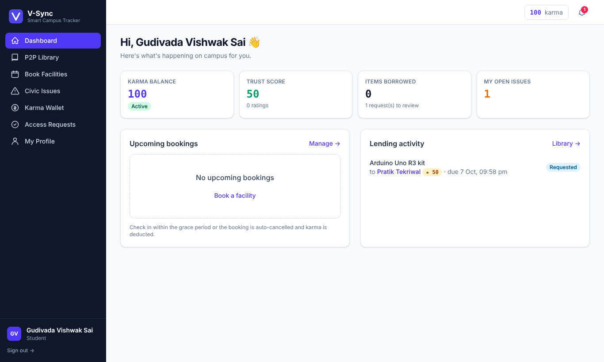

</div>

---

## Table of Contents

1. [Problem Statement](#1-problem-statement)
2. [Objectives](#2-objectives)
3. [Functional Modules](#3-functional-modules)
4. [System Architecture](#4-system-architecture)
5. [Software Process Model](#5-software-process-model)
6. [Design Artifacts → Implementation Traceability](#6-design-artifacts--implementation-traceability)
7. [Core Algorithms](#7-core-algorithms)
8. [Behavioural Models (State Machines)](#8-behavioural-models-state-machines)
9. [Verification & Validation](#9-verification--validation)
10. [Getting Started](#10-getting-started)
11. [Deployment](#11-deployment)
12. [API Reference](#12-api-reference)
13. [Screenshots](#13-screenshots)
14. [Project Structure](#14-project-structure)
15. [Team](#15-team)

---

## 1. Problem Statement

Densely populated university campuses face friction in two areas:

- **Resource allocation.** Shared facilities such as study rooms, labs and laundry suffer from *resource hoarding* and *ghosting*: students book slots and never show up, so a scarce asset sits idle while others are turned away.
- **Facility maintenance.** Infrastructure faults such as broken Wi-Fi, leaking pipes or a failed AC are reported through fragmented channels. The administration gets flooded with **redundant duplicate complaints**, maintenance is delayed, and students have no visibility into progress.

## 2. Objectives

| Type | Objective |
|------|-----------|
| **Primary** | Build a unified, automated hub that democratises access to student resources and accelerates campus maintenance through **smart ticket clustering**. |
| **Secondary** | Reduce resource wastage through a gamified digital penalty system (**Campus Karma**) that enforces accountability. |

## 3. Functional Modules

| # | Module | Key capabilities |
|---|--------|------------------|
| **M1** | **P2P Campus Resource Library** | Students list personal gear (textbooks, microcontrollers, drafters). Borrow requests are routed to the owner, who sees the borrower's **Trust Score** before deciding. Full loan lifecycle with handover and return confirmation. The lender rates the borrower (1–5★) on return. |
| **M2** | **Smart Civic Issue Tracker** | Students report issues with an optional photo. The **Duplicate Detection Engine** clusters matching reports into a single *master ticket*, and priority auto-escalates with report count. The admin assigns tickets to maintenance staff, staff progress them through a guarded state machine, and every reporter is notified on each transition. |
| **M3** | **Campus Karma Wallet** | Append-only points ledger. Karma is earned for lending, valid reports and on-time returns, and deducted for ghosting, late returns and late cancellations. A balance ≤ 0 moves the wallet to **Restricted** standing, which blocks booking and borrowing. Every point value lives in the `PenaltyRule` table and the admin can tune it at runtime. |
| **M4** | **Anti-Ghosting Mechanics** | Facility bookings require check-in, with the window opening 15 min before the slot. A background scheduler runs every minute. Any *confirmed* booking with no check-in after the grace period (default 10 min) is auto-cancelled as **Ghosted** and penalised. Penalties are **idempotent**: one deduction per booking, even if sweeps overlap. |
| **M5** | **Multi-Tier Approval Workflow** | Restricted facilities (e.g. a hardware lab after hours) require a request routed **Faculty Proctor → Hostel Warden**. A rejection at either tier terminates the request. Final approval auto-creates a confirmed reservation. |

**Cross-cutting:**
- Authentication and access control:
  - **Google Sign-In (OpenID Connect SSO)** restricted to VIT Google Workspace accounts. The server verifies Google's signed ID token and its `hd` (hosted domain) claim.
  - Students (`@vitstudent.ac.in`) are auto-provisioned on first sign-in. Staff roles are never self-assigned: an Admin pre-registers them, and they link their Google account on first login.
  - Stateless JWT sessions for the API.
  - Role-Based Access Control (RBAC) across 5 roles: Student, Faculty Proctor, Hostel Warden, Maintenance Staff, Admin.
  - Password login kept only for the demo role accounts, switchable off with `ENABLE_PASSWORD_LOGIN=false`.
- User profiles: Google photo, academic details, trust breakdown, activity stats and public profiles for lenders.
- In-app notifications.
- Admin *Reports & Analytics* dashboard.
- Karma leaderboard.
- Responsive UI.

## 4. System Architecture

V-Sync follows a **three-tier client–server architecture**. A stateless React SPA talks to a RESTful Express API, which persists to MongoDB. The API is organised as a **layered architecture**: routes → services → data models.

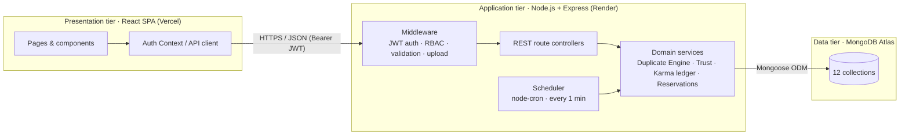

| Tier | Technology | Rationale |
|------|-----------|-----------|
| Presentation | React 18, Vite, Tailwind CSS 4, React Router, Context API | Component reuse (one `IssueRow`/`Badge`/`Card` set across all modules); fast HMR build tooling. |
| Application | Node.js 22, Express 5, JWT, bcrypt, Multer, node-cron | Non-blocking I/O handles bursts of concurrent bookings; cron hosts the anti-ghosting sweep. |
| Data | MongoDB Atlas + Mongoose | Flexible document model suits heterogeneous records (image-backed complaints vs. text lending requests). |
| DevOps | Git/GitHub, GitHub Actions CI, Vercel, Render | Automated regression testing on every push; zero-config cloud deployment. |

**Design principles applied:**
- **Separation of concerns.** Routes, services and models are separate layers.
- **High cohesion / low coupling.** Each module owns its routes and models. Modules interact only through the Karma service and notifications.
- **Single source of truth.** Business rules live in the DB (`PenaltyRule`), not in code.
- **Defensive programming.** Every state transition is guarded, and updates are atomic (`$inc`, conditional `updateOne`) to avoid race conditions between user actions and the scheduler.

## 5. Software Process Model

The project uses the **Agile (Scrum)** process model, justified by four factors:
- a small team of three;
- **volatile requirements**, since karma point values and duplicate thresholds needed tuning;
- a short academic delivery timeline;
- high end-user involvement.

| Sprint | Increment delivered | WBS reference |
|--------|---------------------|---------------|
| Sprint 1 | Auth, RBAC, data models, UI shell, P2P Library + Trust algorithm | 1.3.1, 2.1.x, 3.2.x |
| Sprint 2 | Civic Issue Tracker + Duplicate Detection Engine, maintenance workflow | 1.3.2, 2.2.x |
| Sprint 3 | Karma Wallet ledger, Anti-Ghosting scheduler, Multi-Tier Approval Workflow, analytics | 1.3.3, 2.3.x, 4.3.x |
| Hardening | Unit + integration testing, CI pipeline, deployment | 1.4.x, 3.3.2 |

Requirement volatility is handled architecturally. Karma values and grace periods are **data**: the admin edits them on the *Karma Rules* page, so changing them needs no redeployment.

## 6. Design Artifacts → Implementation Traceability

| Design artifact (Assessments 2 & 3) | Implementation |
|---|---|
| **ER:** USER with STUDENT / FACULTY (ISA generalisation) | `server/src/models/User.js`. Sub-types use a `role` discriminator with role-specific attributes. |
| **ER:** RESOURCE, RESERVATION, LOAN, PENALTY_RULE, KARMA_WALLET, KARMA_TRANSACTION, ISSUE_REPORT, ISSUE, MAINTENANCE_STAFF | One Mongoose model each in `server/src/models/`. MAINTENANCE_STAFF is a USER role. |
| **ER:** ISSUE_REPORT (N) → grouped into → ISSUE (1) | `IssueReport.issue` reference, created by the Duplicate Detection Engine |
| **DFD Level 0:** context (Student, Faculty, Maintenance, Admin) | 5 RBAC roles enforced by `requireRole()` middleware |
| **DFD Level 1:** processes 1.0 – 6.0, data stores D1 – D4 | `routes/auth` (1.0), `resources`+`loans`+`reservations` (2.0), `issues` (3.0, 5.0), `karma` (4.0), `admin` (6.0) |
| **DFD Level 2:** 3.1 Submit → 3.2 Check duplicate → 3.3 Link / 3.4 Create → 3.5 Assign → 3.6 Update → 3.7 Notify | `POST /api/issues` (3.1–3.4), `PATCH /issues/:id/assign` (3.5), `PATCH /issues/:id/status` (3.6), `services/notify.js` (3.7) |
| **STD:** Resource Reservation | `models/Reservation.js`, `routes/reservations.js`, `jobs/sweeps.js` |
| **STD:** Civic Issue Tracking | `models/Issue.js` + `TRANSITIONS` table in `routes/issues.js` |
| **STD:** Karma Wallet standing | `services/karma.js` → `nextWalletStatus()` |
| **STD:** Resource Loan | `models/Loan.js`, `routes/loans.js` |
| **WBS 2.3.2:** automated penalty deduction scripts | `server/src/jobs/sweeps.js` |

**Schema extensions introduced during implementation:**
- `APPROVAL_REQUEST` entity, for module M5.
- `NOTIFICATION` entity, for DFD process 3.7.
- `IMAGE` entity, which stores uploads in MongoDB so they survive ephemeral cloud disks.
- `warden` and `admin` roles on USER.

## 7. Core Algorithms

### 7.1 Duplicate Detection Engine
`server/src/services/duplicateDetector.js` is written as pure functions, so it can be unit-tested in isolation.

1. **Candidate retrieval.** Fetch master tickets in the same `category` with status `open` or `in_progress`, created in the last 30 days.
2. **Keyword extraction.** Normalise the title and description text:
   - lower-case it and strip punctuation;
   - remove stop-words;
   - apply light stemming (*leaking → leak*);
   - fold synonyms (*wi-fi / internet / router → wifi*, *air conditioner → aircon*).
3. **Scoring** for each candidate:
   - `locationScore` is 1.0 for the same building and room, 0.8 for the same building with no room given, 0.4 for the same building in a different room, and 0 for a different building (the candidate is discarded).
   - `textScore` is the **Jaccard similarity** of the two keyword sets, |A∩B| / |A∪B|.
   - `score = 0.5 · locationScore + 0.5 · textScore`
4. **Decision.** If the best `score ≥ 0.6`, the report links to that ticket: `reportCount++`, the reporter is added, and the keyword set grows. Otherwise a new master ticket is created.
5. **Priority escalation by report count:**
   - 1 report = low
   - 2–3 = medium
   - 4–6 = high
   - 7+ = critical

### 7.2 Trust & Rating Algorithm
`server/src/services/trust.js` uses Bayesian smoothing (prior = 50, weight = 3), so a single rating cannot swing a new user's score:

```
ratingComponent = (Σratings·20 + 50·3) / (n + 3)            # 1–5★ → 20–100
punctuality     = (onTime + 1.5) / (onTime + late + 3)       # 0..1
trustScore      = round(0.7 · ratingComponent + 0.3 · punctuality · 100)
```

### 7.3 Karma Ledger
- **Append-only ledger.** Every change writes a `KarmaTransaction` with `balanceAfter`.
- **Atomic updates.** The wallet balance changes through an atomic `$inc`.
- **Idempotency.** A rule fires at most once per `(user, rule, referenced object)`.
- **Default economy.** The defaults below are editable by the admin.

| Rule | Δ karma | Trigger |
|------|---------|---------|
| `GHOST_RESERVATION` | −20 | No check-in within the grace period (10 min) |
| `LATE_RETURN` | −15 | Borrowed item passes its due date |
| `LATE_CANCELLATION` | −5 | Cancelling < 60 min before the slot |
| `INVALID_ISSUE_REPORT` | −5 | Admin rejects a report as invalid |
| `LEND_ITEM` | +10 | Lender completes a loan |
| `VALID_ISSUE_REPORT` | +5 | New master ticket created |
| `ISSUE_RESOLVED_BONUS` | +5 | Original reporter, when resolved |
| `ON_TIME_RETURN` | +3 | Borrower returns on time |
| `COMPLETED_RESERVATION` | +2 | Proper check-in and check-out |
| `DUPLICATE_CONFIRMATION` | +1 | Confirming an existing issue |

## 8. Behavioural Models (State Machines)

Every transition below is enforced server-side. An invalid transition returns **HTTP 409 Conflict**.

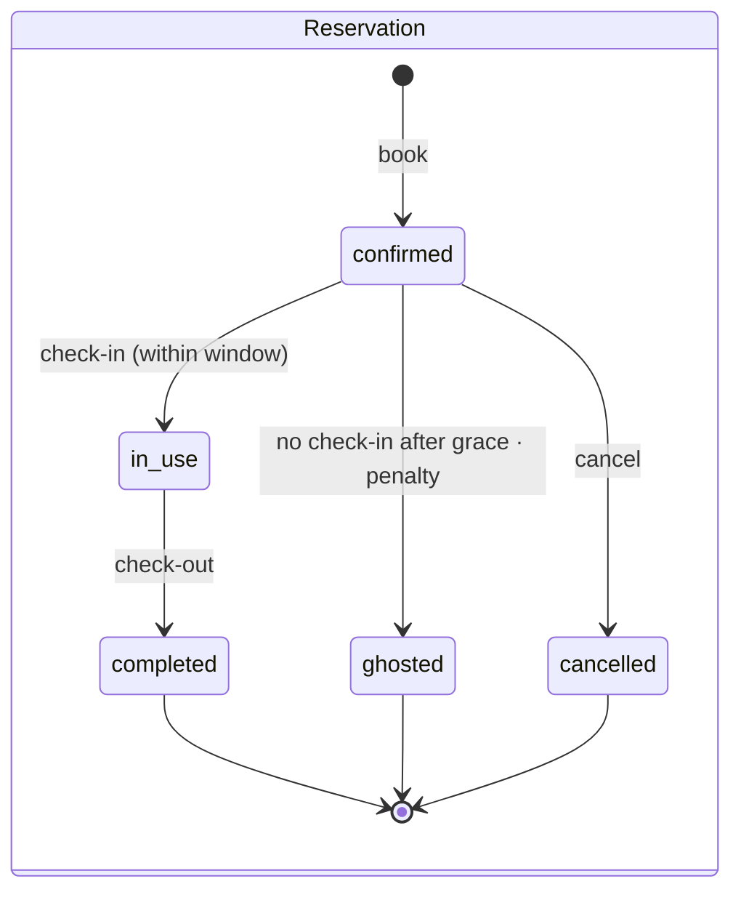

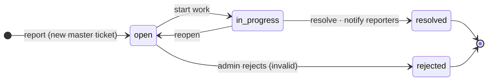

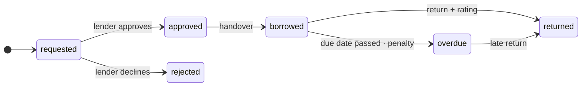

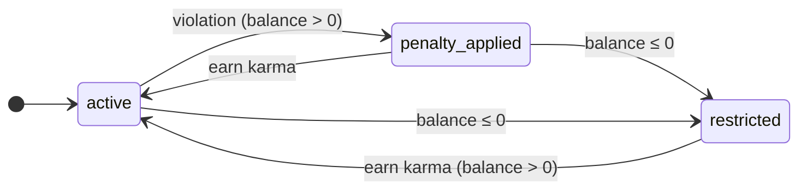

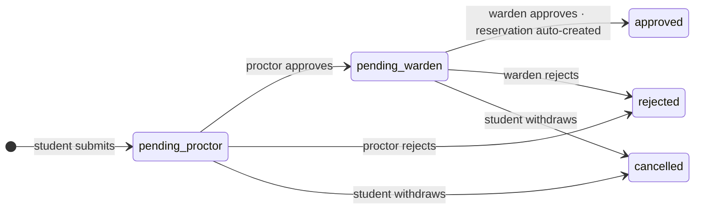

## 9. Verification & Validation

| Level | Scope | Tooling |
|-------|-------|---------|
| **Unit testing** | Duplicate engine (9 cases incl. boundary/edge cases), Trust algorithm (4), wallet state machine (4) | Jest |
| **Integration testing** | End-to-end API flows for all 5 modules against a real MongoDB: auth, loan lifecycle + overdue sweep, duplicate merge + resolution, ghosting idempotency + restricted lockout, both approval tiers, analytics + rule tuning | Jest + Supertest |
| **Regression testing** | Full suite runs on every push and pull request | GitHub Actions CI (MongoDB 7 service container) |
| **System / UAT** | Scripted browser walkthrough as every role | Playwright (manual run) |

```bash
cd server
npm test                                                         # unit tests
MONGO_URI_TEST=mongodb://127.0.0.1:27017/vsync_test npm test     # unit + integration (29 tests)
```

> **Note:** Integration tests run against an isolated database (`MONGO_URI_TEST`). The suite resets that database before and after each run so every run starts clean, which is why it should be separate from the database the app uses.

**Notable edge cases covered:**
- A student reporting the same issue twice gets 409.
- A competing borrow request is auto-rejected when another is approved.
- Overlapping bookings are rejected against facility capacity.
- Overlapping sweeps don't double-penalise.
- A wallet drained to 0 is restricted, then reactivated once karma is earned.
- The warden cannot act before the proctor.
- An issue cannot skip from `open` to `resolved`.

## 10. Getting Started

**Prerequisites:** Node.js 22 LTS (minimum 20.19, required by Mongoose 9) and a MongoDB instance (a free Atlas cluster or local `mongod`).

```bash
git clone https://github.com/VishwakSai1805/v-sync.git
cd v-sync
npm run install:all                 # installs server + client

cp server/.env.example server/.env  # then set MONGO_URI and JWT_SECRET
npm run seed                        # demo users, facilities, items, issues

npm run dev:server                  # API  → http://localhost:5000
npm run dev:client                  # Web  → http://localhost:5173 (new terminal; proxies /api)
```

### Signing in
- **Real users:** use **Sign in with Google** with a VIT account. Students get an account automatically and complete their reg. no., year and hostel block on the profile page.
- **Demo accounts** (one per role, for demonstrations): use the **Demo accounts** section on the login page. The password is `password123`.

| Role | Email |
|------|-------|
| Student | `vishwak@vitstudent.ac.in` · `suyash@vitstudent.ac.in` · `pratik@vitstudent.ac.in` |
| Faculty Proctor | `proctor@vit.ac.in` |
| Hostel Warden | `warden@vit.ac.in` |
| Maintenance Staff | `maint1@vit.ac.in` · `maint2@vit.ac.in` |
| Admin | `admin@vit.ac.in` |

### Environment variables (`server/.env`)
| Variable | Purpose |
|----------|---------|
| `MONGO_URI` | MongoDB / Atlas connection string |
| `JWT_SECRET` | Token signing secret (long random string) |
| `ALLOWED_EMAIL_DOMAINS` | Institutional domains allowed to self-register |
| `CLIENT_ORIGIN` | Frontend URL(s) allowed by CORS |
| `KARMA_STARTING_BALANCE` | Welcome karma (default 100) |
| `ENABLE_SCHEDULER` | Anti-ghosting scheduler on/off (default on) |
| `SEED_DEMO_DATA` | Load demo accounts and data on first boot if the database is empty |
| `GOOGLE_CLIENT_ID` | OAuth 2.0 Web client ID from Google Cloud (empty = Google sign-in off) |
| `GOOGLE_ALLOWED_DOMAINS` | Workspace domains allowed to sign in (default `vitstudent.ac.in,vit.ac.in`) |
| `GOOGLE_STUDENT_DOMAINS` | Domains auto-provisioned as students (default `vitstudent.ac.in`) |
| `ENABLE_PASSWORD_LOGIN` | Email/password login for demo accounts (default `true`) |

## 11. Deployment

| Component | Platform | Configuration |
|-----------|----------|---------------|
| Database | **MongoDB Atlas** (M0 free) | Create a DB user. Under Network Access, allow `0.0.0.0/0`. |
| Backend | **Render** web service | Root `server` · build `npm install` · start `npm start` · env vars as above, plus `SEED_DEMO_DATA=true` to load the demo accounts on first boot (the free tier has no shell). Seeding runs only when the database is empty. `render.yaml` blueprint included. |
| Frontend | **Vercel** | Root `client` · preset *Vite* · env `VITE_API_URL=https://<api>.onrender.com`. `vercel.json` handles SPA routing. |
| Google Sign-In | **Google Cloud Console** | Create an OAuth 2.0 *Web application* client. Add the Vercel URL and `http://localhost:5173` to **Authorized JavaScript origins**, and `<url>/auth/callback` for each to **Authorized redirect URIs**. Set the client ID as `GOOGLE_CLIENT_ID` on Render. No client secret is needed: sign-in uses the OpenID Connect redirect flow (`response_type=id_token` with `state` and `nonce`), and the server verifies the ID token. A redirect is used instead of Google's embedded button because ad blockers often block that iframe. |

> Render's free tier sleeps after ~15 min idle, so the first request then takes ~30 s. The scheduler resumes on wake and catches up on missed ghost and overdue sweeps. The admin can also trigger a sweep manually from the dashboard.

## 12. API Reference

All routes are under `/api`. Every route except auth and images needs `Authorization: Bearer <token>`.

| Resource | Endpoints |
|----------|-----------|
| Auth | `GET /auth/config` · `POST /auth/google` · `POST /auth/login` · `POST /auth/register` · `GET/PATCH /auth/me` · `POST /auth/change-password` |
| Users | `GET /users/:id/profile` (`:id` may be `me`) |
| Resources | `GET /resources?kind=p2p\|facility&q=&category=&mine=` · `POST /resources` *(multipart)* · `GET/PATCH/DELETE /resources/:id` |
| Loans | `GET /loans?role=borrower\|lender` · `POST /loans` · `POST /loans/:id/{approve,reject,cancel,handover,return}` |
| Reservations | `GET /reservations` · `POST /reservations` · `POST /reservations/:id/{check-in,check-out,cancel}` |
| Issues | `GET /issues` · `POST /issues` *(multipart)* · `GET /issues/:id` · `PATCH /issues/:id/assign` · `PATCH /issues/:id/status` |
| Karma | `GET /karma/wallet` · `GET /karma/leaderboard` · `GET /karma/rules` · `PUT /karma/rules/:id` · `POST /karma/adjust` |
| Approvals | `GET /approvals` · `POST /approvals` · `POST /approvals/:id/decide` · `POST /approvals/:id/cancel` |
| Admin | `GET /admin/analytics` · `GET/POST /admin/users` · `PATCH /admin/users/:id` · `GET /admin/staff` · `POST /admin/run-sweeps` |
| Misc | `GET /notifications` · `POST /notifications/read-all` · `GET /images/:id` · `GET /health` |

The API uses these status codes:
- `400` validation error
- `401` unauthenticated
- `403` forbidden (RBAC, or restricted wallet)
- `404` not found
- `409` illegal state transition or conflict

## 13. Screenshots

| | |
|:-:|:-:|
| 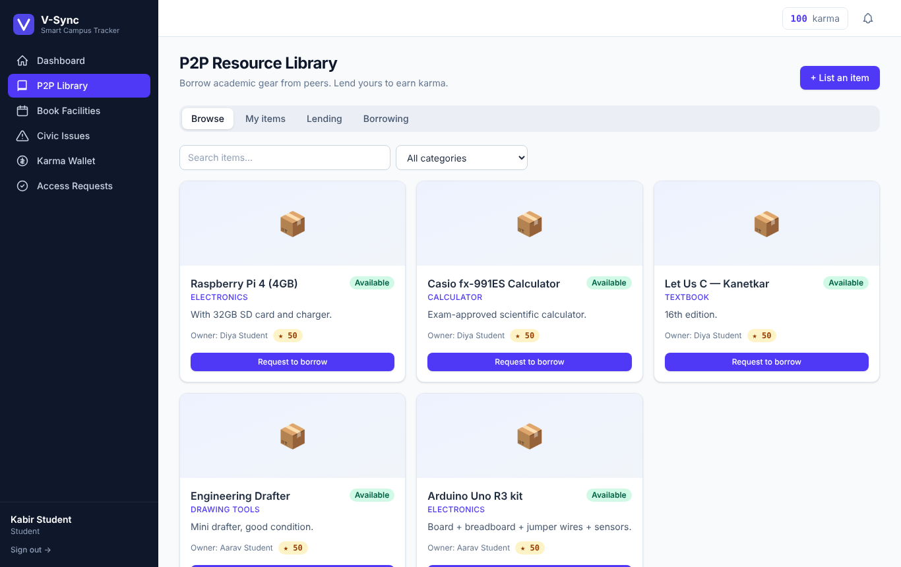 **P2P Resource Library** | 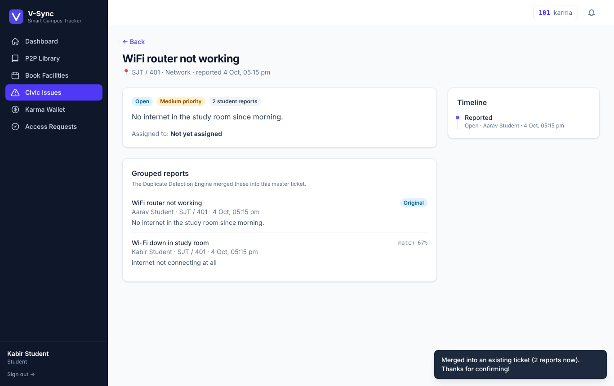 **Duplicate Detection: two reports, one ticket** |
| 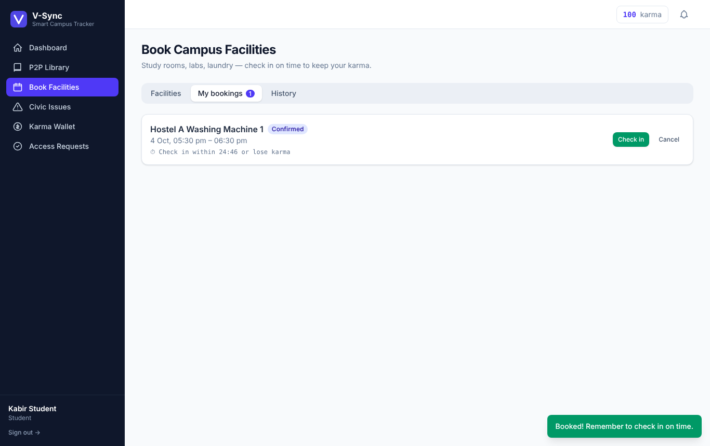 **Facility booking with check-in countdown** | 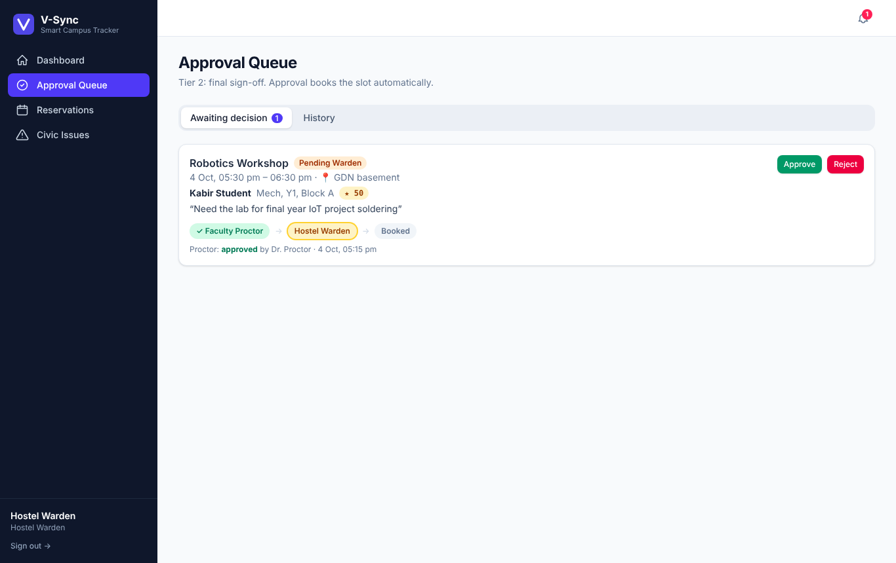 **Multi-tier approval (Proctor ✓ → Warden)** |
| 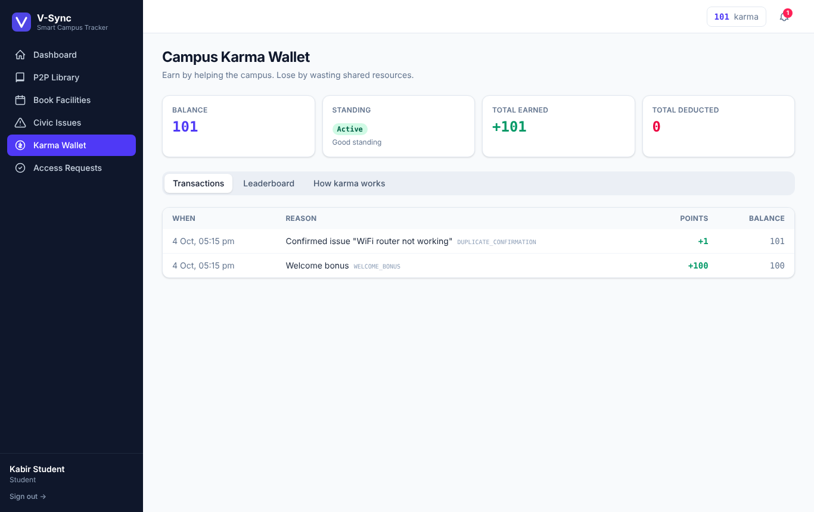 **Karma Wallet ledger** | 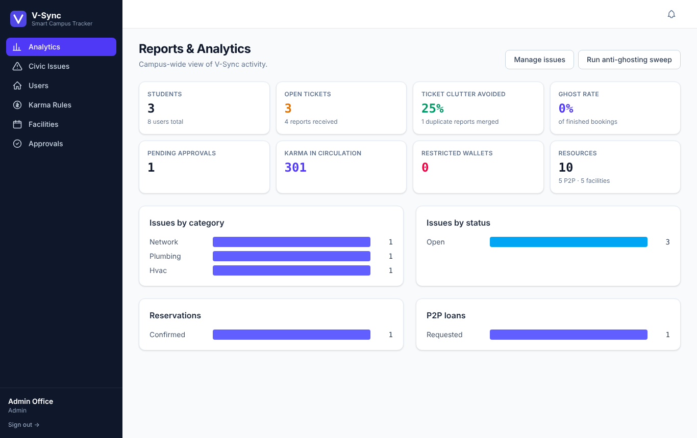 **Admin Reports & Analytics** |
| 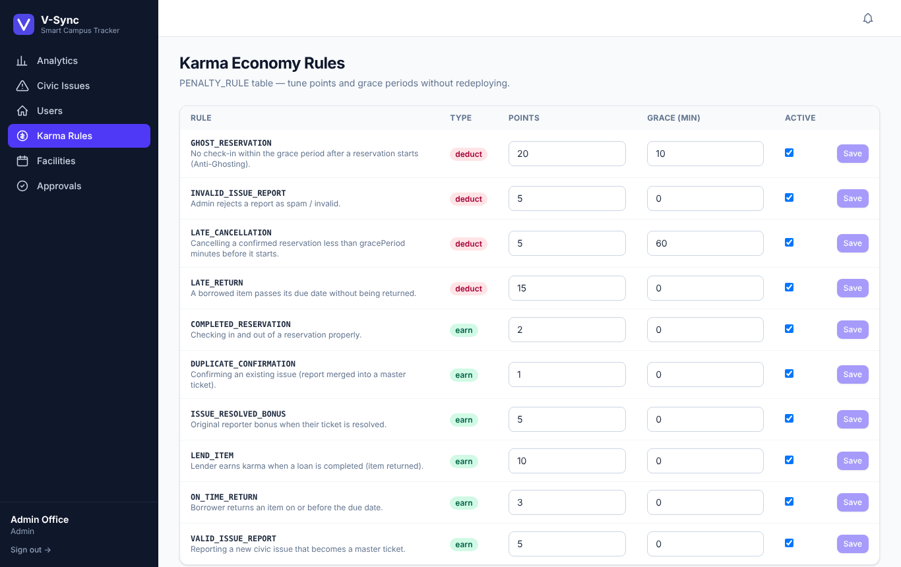 **Runtime-editable karma rules** | 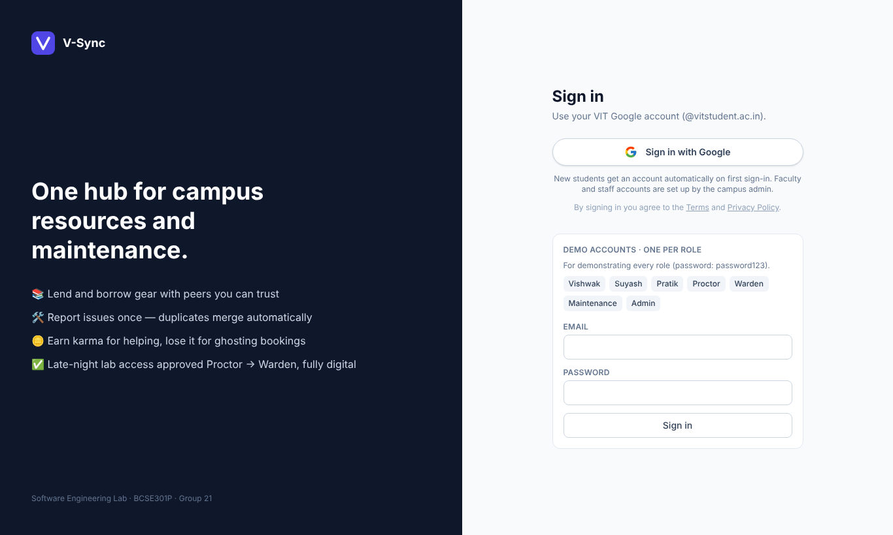 **Login with demo accounts** |

## 14. Project Structure

```
v-sync/
├── client/                         # React SPA
│   ├── src/
│   │   ├── components/             # Layout (role-based nav, notifications), UI primitives
│   │   ├── lib/                    # API client, AuthContext, hooks, formatters
│   │   └── pages/                  # Dashboard, Library, Facilities, Issues, IssueDetail,
│   │                               # Karma, Approvals, Maintenance, Admin, Auth
│   └── vercel.json
├── server/                         # Express REST API
│   ├── src/
│   │   ├── config/                 # environment configuration
│   │   ├── models/                 # 12 Mongoose schemas
│   │   ├── routes/                 # REST controllers per module
│   │   ├── services/               # duplicateDetector, trust, karma, reservations, notify
│   │   ├── middleware/             # JWT auth + RBAC, error handling, image upload
│   │   ├── jobs/sweeps.js          # anti-ghosting & overdue scheduler
│   │   ├── seed.js                 # demo data
│   │   └── index.js / app.js       # bootstrap
│   └── tests/                      # unit.test.js, api.test.js
├── docs/screenshots/
├── .github/workflows/ci.yml        # CI pipeline
└── render.yaml                     # Render blueprint
```

## 15. Team

| Member | Reg. No. | Role (Role-based WBS) |
|--------|----------|-----------------------|
| Gudivada Vishwak Sai | 24BYB0053 | Backend Developer: REST APIs, JWT authentication, core algorithms |
| Suyash Singh | 24BYB0078 | Frontend Developer: React interfaces, state management |
| Pratik Tekriwal | 24BYB0079 | Database Administrator / QA: MongoDB provisioning, test plans & reports |

---

<div align="center">
Released under the <a href="LICENSE">MIT License</a> · Built for BCSE301P Software Engineering Lab, VIT
</div>
